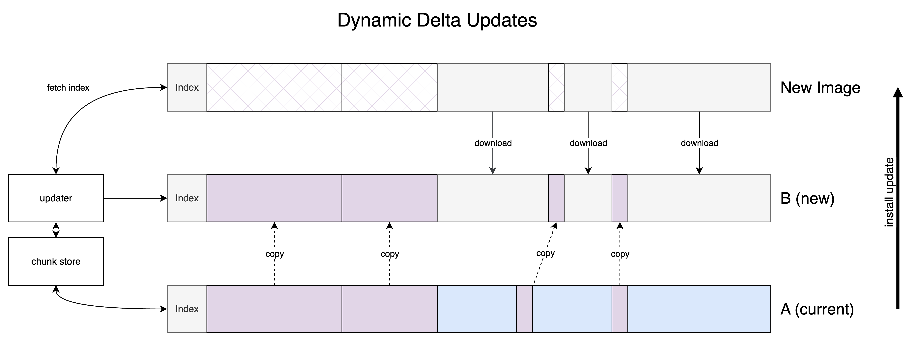

# Operating System A/B Updates

### ...and delta updates

---

# What are OS A/B Updates

* Full device update
    * Linux kernel and device tree
    * Operating System (root filesystem, aka root-fs)
    * User applications

* Two copies of the partitions are stored
    * Apply update to the inactive partition
    * Rollback to previous partition on an error

---

# What are OS A/B Updates (cont.)

* OS Updates are generally large 😥
    * Yocto images ~200MB (headless and with container engine)
    * Debian based ~700MB (headless and with container engine)
    * Debian with Desktop ~2GB

---

# Delta updates

* Sending only "what changed" between two updates to reduce the download size

---

# Dynamic vs. Static Delta Updates

* Method 1: Dynamic
    * One file per release
    * Index file is included as part of the update
    * Device must download the relevant "parts" of the image
    * More difficult to predict how "efficient" the download will be

* Method 2: Static
    * Delta between two specific versions is generated before sending to the device
    * Delta file is typically smaller (download size is known upfront)
    * More complex hosting as there are multiple files per release

---

# Dynamic Updates



---

# Static Updates


---

# Technologies that support delta updates

|Tech.|Dynamic|Static|
|-----|:-------:|:------:|
|Rauc|✅|🚫|
|mender|🚫|✅ (if you pay for it)|
|Rugix|✅|✅|
|SWUpdate|✅(requires manual integration)|✅(requires manual integration)|


---

# What is Rugix?

Rugix is an open-source tool suite to build reliable embedded Linux devices with efficient and secure over-the-air (OTA) update capabilities.

* Rugix is actually now composed of two components
    * Rugix Ctrl (perform reliable A/B updates)
    * Rugix Bakery (Build OS Images for use with A/B Robust Updates)

---

# Integrating Rugix with Yocto

* **meta-rugix** Layer New Yocto Layer to integrate Rugix into your Yocto images
* **meta-tedge** Integrates the new meta-rugix layer to build a thin-edge.io and Rugix enabled image

* Smaller OS images than Debian (~200MB instead of ~700MB)

---

# Demo time

---

# Real-world delta update comparison

### Dynamic delta update

```sh
INFO downloaded 14.4% (27.5548019MiB/191.8140869MiB) of the full bundle
```

### Static delta update

```sh
INFO downloaded 100.0% (9.9613685MiB/9.9613685MiB) of the full bundle
```

---

# Device Integration

* Currently only an out-of-the-box integration is provided for Raspberry Pi 4/5 (requires the TryBoot bootloader to be already installed)
* Other integrations are possible - please reach out to [Silitics](https://oss.silitics.com/rugix/commercial-support) for Commercial support
* Rugix - planned features: support for safe migration of existing RAUC and Mender systems in the field
    * PoC was already successful to migrate from Mender and Rauc to Rugix

---

# Links

- [Rugix](https://oss.silitics.com/rugix/) project page
- [Rugix Delta Update blog post](https://oss.silitics.com/rugix/blog/efficient-delta-updates/)
- [meta-rugix](https://github.com/silitics/meta-rugix) - Rugix Yocto Layer
- [meta-tedge](https://github.com/thin-edge/meta-tedge)- thin-edge.io Yocto Layer
