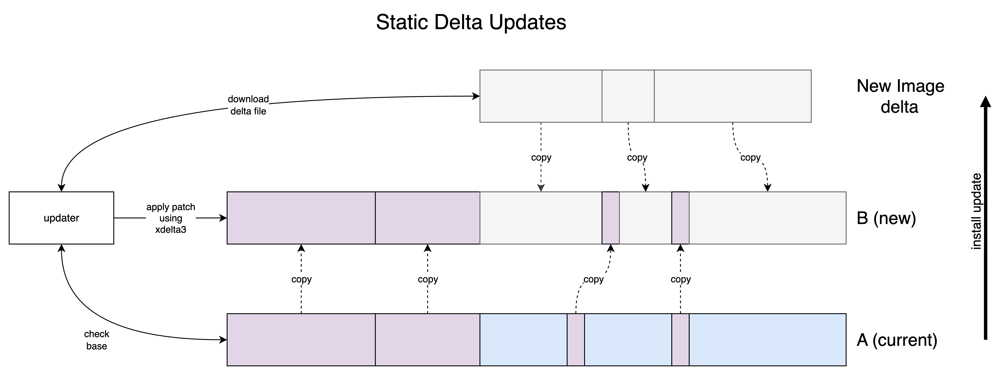

# Operating System A/B Updates

### ...and delta updates

---

# What are OS A/B Updates

* Full device update
    * Linux Kernel and device tree
    * Operating System (root filesystem, aka root-fs)
    * User applications

* Two copies of the partitions are stored
    * Apply updated to the inactive partition
    * Rollback to previous partition on an error

---

# What are OS A/B Updates (cont.)

* OS Updates are generally large 😥
    * Yocto images ~200MB (headless and with container engine)
    * Debian based ~700MB (headless and with container engine)
    * Debian with Desktop ~2GB

---

# Delta updates

* Sending on "what changed" between two updates to reduce the download size

---

# Dynamic vs. Static Delta Updates

* Method 1: Dynamic
    * One file per release
    * Index file is included as part of the update
    * Device must download the relevant "parts" of the image

* Method 2: Static
    * Generally smaller files (higher compression is possible)
    * Device only has to download the image (as the user has selected the correct delta image)
    * More complex hosting as there are multiple files per release

---

# Dynamic Updates

---

# Static Updates

---

# Technologies that support delta updates

|Tech.|Dynamic|Static|
|-----|:-------:|:------:|
|Rauc|✅|🚫|
|mender|🚫|✅ (if you pay for it)|
|Rugix|✅|✅|

Note: SWUpdate might also support some of these features but wasn't part of the comparison

---

# What is Rugix?

* Rugix has two main parts
    * Rugix-ctrl (perform reliable A/B updates)
    * Rugix-bakery (Build OS Images for use with A/B Robust Updates)

---

# Integrating Rugix with Yocto

* meta-rugix
* Smaller OS images than Debian (~200MB instead of 500MB)
    
---

